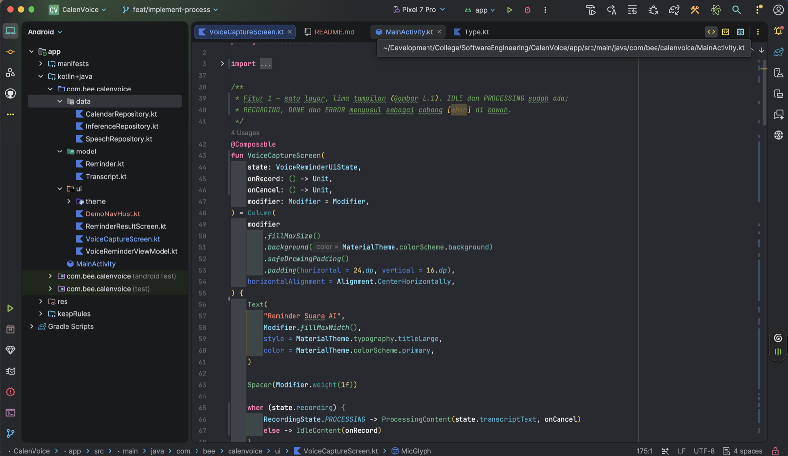
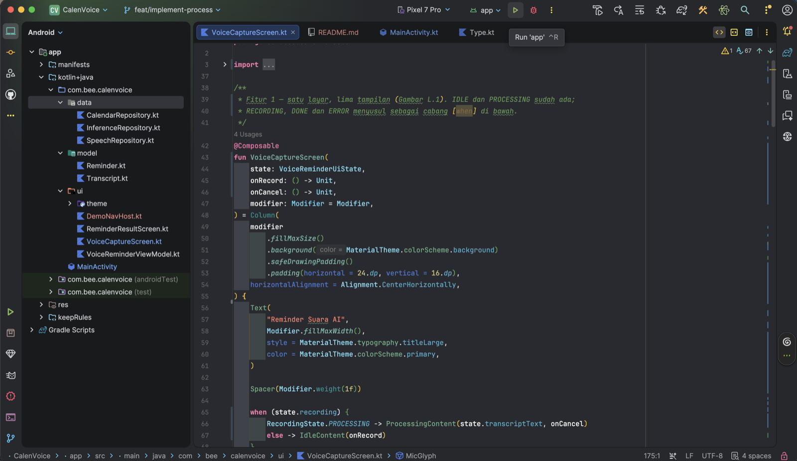
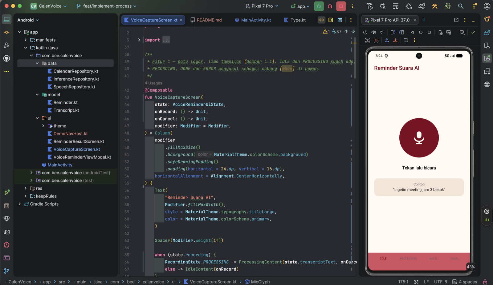

# CalenVoice (VoiceReminder AI)

Aplikasi Android untuk mencatat agenda lewat suara: rekam ucapan, ubah jadi teks,
ekstraksi judul/tanggal/jam oleh Gemini, lalu simpan sebagai event di kalender bawaan
perangkat.

Implementasi dari dokumen desain *Module 3 - AFL3 - Dokumen Desain Sistem VoiceReminder AI*.
Penamaan kelas mengikuti rancangan final pada Tabel 6.1 dokumen tersebut.

| | |
|---|---|
| Mata kuliah | Software Engineering |
| Tugas | AFL3 / Modul 4, Progress Pengerjaan Software |
| Kelompok | Kelompok 2 |
| Dosen Pengampu | Christian, S.Kom., M.MT. |

**Anggota:** Zhafira Zila Qonita (0706012424027) · Bee Bee Wijaya (0706012424019) ·
Esa Nuriana (0706012424036) · Miftach Hydayat (0706012424020) ·
Rizkiyah Chairunnisa Nasution (0706012424037)

---

## 1. Progress: ± 40%

| Bagian | | |
|---|---|---:|
| Fondasi & arsitektur | `████████▌░` | 85% |
| Fitur 1: Voice Recording & Speech-to-Text | `███▌░░░░░░` | 35% |
| Fitur 2: Inference Gemini | `█▌░░░░░░░░` | 15% |
| Fitur 3: Save Calendar | `████░░░░░░` | 40% |

**Sudah jadi, yaitu seluruh tampilan dan rangka arsitekturnya:**
struktur 3 lapisan, model domain, kontrak 3 repository, design system, izin di manifest,
layar IDLE & PROCESSING, layar HASIL dengan 4 tampilan (draf, menyimpan, berhasil, gagal),
validasi FR-05/FR-06 beserta 2 unit test yang lulus.

**Belum jadi, yaitu seluruh logika bisnisnya:**

| Belum ada | Lokasi |
|---|---|
| `AndroidSpeechRepository.listen()` | `data/SpeechRepository.kt` |
| `GeminiInferenceRepository.extract()` | `data/InferenceRepository.kt` |
| `DeviceCalendarRepository.createEvent()` | `data/CalendarRepository.kt` |
| Orkestrasi alur di ViewModel | `ui/VoiceReminderViewModel.kt` |
| Tampilan RECORDING, DONE, ERROR | `ui/VoiceCaptureScreen.kt` |

Ketiga method repository itu masih `TODO()` dan belum pernah dipanggil dari mana pun,
jadi aplikasi tetap berjalan tanpa crash. Lihat bagian 3.

---

## 2. Cara Menjalankan lewat Android Studio

### Langkah 1: buka proyeknya

Ekstrak ZIP ini, lalu buka Android Studio dan pilih **File › Open**, arahkan ke folder
`CalenVoice`. Tunggu sampai **Gradle Sync** selesai. Jika Android Studio meminta mengunduh
SDK 37, setujui saja.



### Langkah 2: pilih perangkat lalu tekan Run

Pada bar atas, pastikan perangkat sudah terpilih (contoh di gambar: **Pixel 7 Pro**) dan
modul yang dijalankan adalah **app**. Perangkat bisa berupa emulator dengan API 24 ke atas,
atau HP Android yang *USB debugging*-nya aktif.

Tekan tombol **Run** berbentuk segitiga hijau, atau pakai pintasan **Ctrl+R**.



### Langkah 3: aplikasi berjalan

Android Studio membangun APK, memasangnya, lalu menjalankannya di perangkat. Layar awal
yang muncul adalah tampilan IDLE.



Panel merah muda di bagian paling bawah layar (`IDLE`, `PROCESSING`, `HASIL`, `GAGAL`)
adalah panel uji sementara untuk berpindah tampilan. Penjelasannya ada di bagian 3.


### Melihat tampilan tanpa memasang aplikasi

Buka `ui/VoiceCaptureScreen.kt` atau `ui/ReminderResultScreen.kt`, lalu klik **Split** atau
**Design** di pojok kanan atas editor. Tersedia 6 preview.

### Prasyarat

Android Studio Ladybug ke atas, JDK 17 ke atas, AGP 9.4.1, Kotlin 2.2.10, compileSdk 37,
**minSdk 24**. Gradle 9.6.0 sudah termasuk lewat *wrapper*, tidak perlu dipasang sendiri.

---

## 3. Penting: Semua Perpindahan Masih Simulasi

Aplikasi bisa dijalankan dan seluruh tampilan bisa ditelusuri, **tetapi belum pernah
menyentuh mikrofon, Gemini API, maupun kalender perangkat.** Selama repository masih
`TODO()`, `MainActivity` memanggil `DemoNavHost` (`ui/DemoNavHost.kt`) yang hanya
memindahkan status.

| Yang Anda lakukan | Yang sebenarnya terjadi |
|---|---|
| Menekan mikrofon | Pindah ke PROCESSING, transkrip contoh ditampilkan |
| Menunggu 1,5 detik | Pindah sendiri ke HASIL, meniru FR-04 selesai, bukan hasil STT asli |
| Menekan "Simpan ke Kalender" | Jeda 1,2 detik lalu status Berhasil. **Tidak ada event yang ditulis** |
| Menekan `GAGAL` di panel bawah | Menyalakan mode gagal supaya tampilan error bisa diuji |

Panel `IDLE · PROCESSING · HASIL · GAGAL` di bagian paling bawah layar adalah **alat bantu
pengujian, bukan bagian dari rancangan sistem**. Panel itu beserta berkas
`ui/DemoNavHost.kt` dihapus begitu `VoiceReminderViewModel` tersambung ke repository asli.

Data contoh yang dipakai: judul `Meeting`, tanggal `2026-10-10`, jam `15:00`.

---

## 4. Struktur Folder

```
CalenVoice/
├── app/src/main/java/com/bee/calenvoice/
│   ├── MainActivity.kt               titik masuk aplikasi
│   ├── model/                        Entity, hanya di memori, tanpa basis data lokal (Bab 5)
│   │   ├── Transcript.kt             Transcript, RecordingState, validasi FR-05/FR-06
│   │   └── Reminder.kt               Reminder dan CalendarEvent
│   ├── data/                         Lapisan 2, satu-satunya lapisan ke dunia luar
│   │   ├── SpeechRepository.kt       Fitur 1, SpeechRecognizer
│   │   ├── InferenceRepository.kt    Fitur 2, Gemini API (Client-Server)
│   │   └── CalendarRepository.kt     Fitur 3, CalendarContract
│   └── ui/                           Lapisan 1, MVVM
│       ├── VoiceReminderViewModel.kt pemegang state dan urutan langkah
│       ├── VoiceCaptureScreen.kt     layar Fitur 1
│       ├── ReminderResultScreen.kt   layar Fitur 2 dan 3
│       ├── DemoNavHost.kt            SEMENTARA, navigasi uji, hapus nanti
│       └── theme/                    Color.kt, Type.kt, Theme.kt
├── app/src/test/java/com/bee/calenvoice/
│   └── TranscriptTest.kt             unit test validasi FR-05 dan FR-06
├── docs/                             gambar cara menjalankan dan arsip, tidak di-compile
└── README.md
```

Aplikasi ini **tidak memiliki basis data lokal**. Sesuai Bab 5 dokumen desain, kalender
bawaan perangkat adalah satu-satunya tempat data bertahan, jadi tidak ada Room maupun SQLite.

---

## 5. Tahap Berikutnya

1. `AndroidSpeechRepository`, sambungkan ke `SpeechRecognizer` dan izin mikrofon
2. Tampilan RECORDING, DONE, ERROR di `VoiceCaptureScreen`
3. Sambungkan `MainActivity` ke `VoiceReminderViewModel`, lalu hapus `DemoNavHost`
4. `GeminiInferenceRepository`, permintaan HTTPS dan penguraian JSON (FR-08, FR-09)
5. `DeviceCalendarRepository`, penulisan ke `CalendarContract.Events` (Tabel 5.2)
6. Uji alur gabungan UC-01, dari tekan tombol sampai event tersimpan
